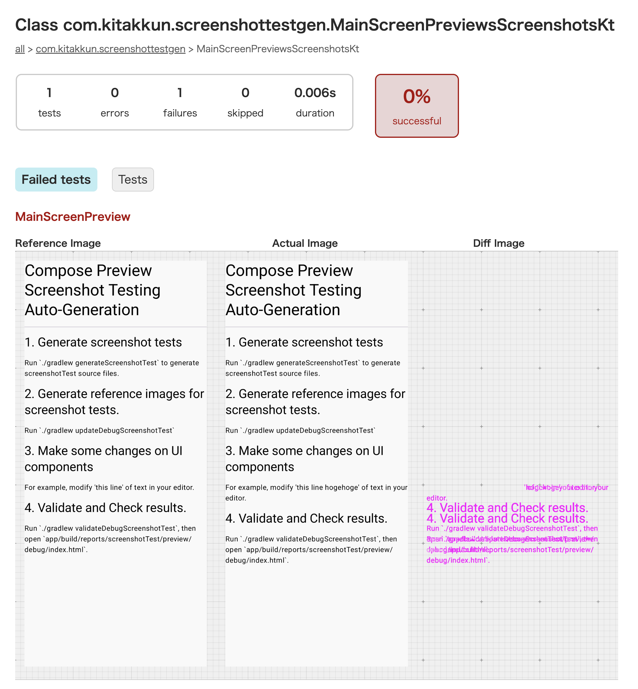

# Compose Preview Screenshot Testing Generation Sample

[日本語](README-ja.md) | English

This repository is a sample project that includes a plugin which automatically generates test cases
for [Compose Preview Screenshot Testing](https://developer.android.com/studio/preview/compose-screenshot-testing)
– a Gradle Plugin officially provided by Google – by leveraging AST analysis.

## Verification Process

To verify the entire flow from automatic screenshot generation to execution, please follow these
steps:

1. Run `./gradlew generateScreenshotTest` to generate the screenshot tests.
2. Run `./gradlew updateDebugScreenshotTest` to generate the reference images for the screenshot
   tests.
3. Make some modifications to the implementation of the `MainScreen` component.
4. Run `./gradlew validateDebugScreenshotTest` to review the test results (the tests should fail).

Example test result:


## Future Plans

Regarding future developments, we currently plan to:

- Publish the Gradle Plugin on Maven Central (if there is enough demand)
- Migrate to the Kotlin Analysis API

## Troubleshooting

The screenshot test auto-generation plugin provided in this repository is minimally implemented and
has several practical limitations. In most cases, these issues can be resolved by leveraging
information obtained from AST analysis, so we recommend adjusting the implementation to suit your
project's needs.

Below are some common pitfalls:

### Unable to Resolve `private` Declarations Referenced within Preview Functions

For example, you might define a `PreviewParameterProvider` as `private` and use it inside a Preview
function, as shown below:

```kotlin
@Composable
fun HogeView(checked: Boolean) {
    // ...
}

private class HogeViewPreviewParameterProvider : PreviewParameterProvider<Boolean> {
    override val values: Sequence<Boolean> = sequenceOf(true, false)
}

@Preview
@Composable
fun HogeViewPreview(
    @PreviewParameter(HogeViewPreviewParameterProvider::class) checked: Boolean,
) {
    HogeView(checked)
}
```

In such cases, you need to modify the plugin so that private functions are also copied to the test
cases. For `KtDeclaration`, you can use the `isPrivate()` extension function to include private
declarations in the test file.

### Errors Occurring When Preview Functions Are Declared Inside a Class

Since Jetpack Compose is a flexible framework, it is possible to declare Preview functions inside a
class, as shown below:

```kotlin
class Hoge {
    @Composable
    fun Content() {
        // ...
    }

    @Preview
    @Composable
    fun Preview() {
        Content()
    }
}
```

Currently, the plugin provided in this repository does not account for this scenario, so it is
recommended to move the view implementation outside the class. Additionally, if such an
implementation already exists, you can exclude it by utilizing AST node information such as the
`isTopLevel` property.

### Import Statements Causing Compile Errors

Although not documented in detail, there have been instances where an import such as
`import kotlinx.percelize.Parcelize` causes a reference error. In such cases, it is recommended to
modify the logic around `importDirectives.forEach` to exclude some imports.

### Excluding Specific Previews from Screenshot Testing

At present, there is no implemented way to exclude specific Previews from screenshot testing. As a
workaround, you can define a custom annotation (for example, `@IgnoreScreenshotTest`) within your
project and modify the plugin to skip any Preview that includes this annotation.
